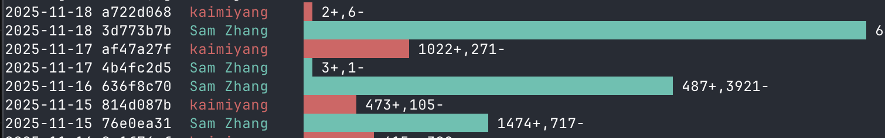

# git-bar

bar length reflects commit changes; daily author activity at a glance.

```bash
npx git-bar --days 7
```



## Install & run
Prefer no-install? Use `npx`:
```bash
npx git-bar --days 7
```

or install with npm/pnpm
```bash
npm install -g git-bar   # once published on npm
```

## Command & options
```bash
git-bar [--author keyword] [--author keyword2] [--days N]
```
- `--author <keyword>`: filter authors by substring; repeatable; OR logic; case-insensitive.
- `--days <N>`: show only the last N days; overrides the default fetch limit.

## Findability
git calendar, git stats, git activity graph, git contributions chart, git commits per day, git author stats terminal.

## License
MIT
